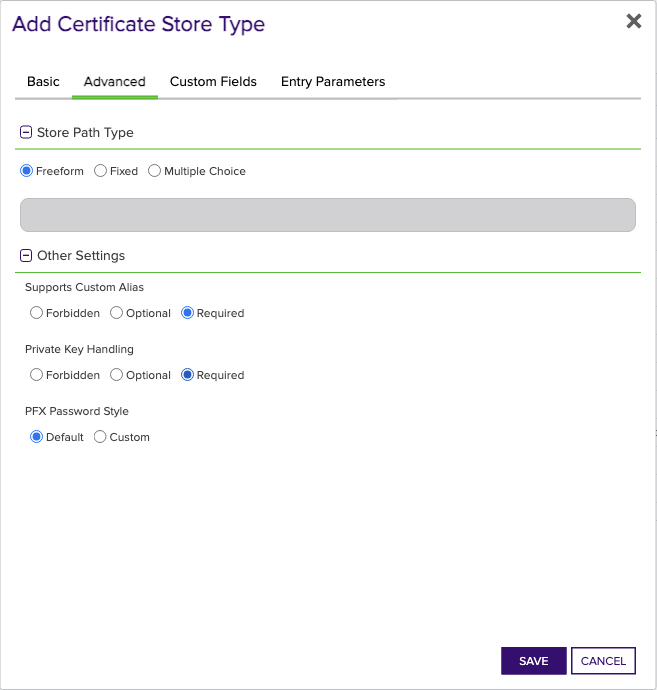
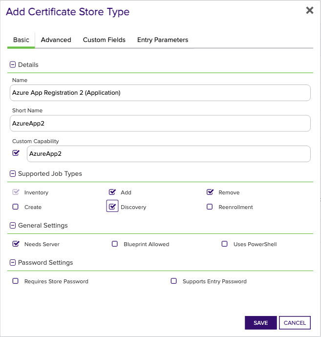
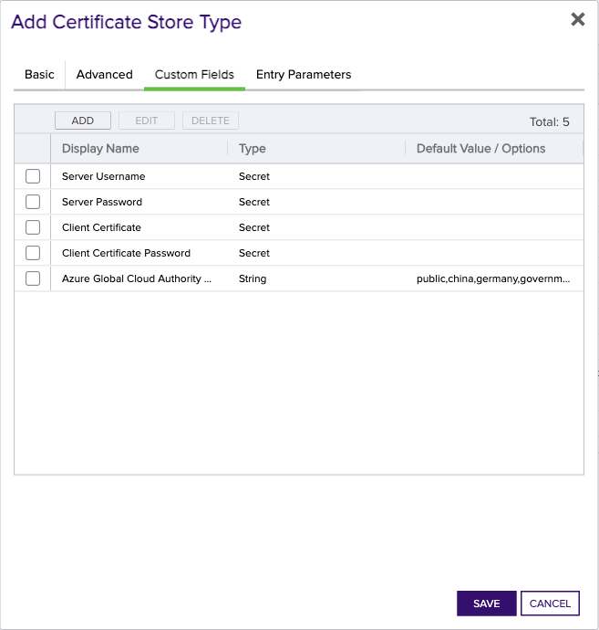

<h1 align="center" style="border-bottom: none">
    Azure App Registration and Enterprise Application Universal Orchestrator Extension
</h1>

<p align="center">
  <!-- Badges -->

<a href="https://github.com/Keyfactor/azure-application-orchestrator/releases"></a>


</p>

<p align="center">
  <!-- TOC -->
  <a href="#support">
    <b>Support</b>
  </a>
  ·
  <a href="#installation">
    <b>Installation</b>
  </a>
  ·
  <a href="#license">
    <b>License</b>
  </a>
  ·
  <a href="https://github.com/orgs/Keyfactor/repositories?q=orchestrator">
    <b>Related Integrations</b>
  </a>
</p>

## Overview

The Azure App Registration and Enterprise Application Orchestrator extension remotely manages both Azure [App Registration/Application](https://learn.microsoft.com/en-us/entra/identity-platform/certificate-credentials) certificates and [Enterprise Application/Service Principal](https://docs.microsoft.com/en-us/azure/active-directory/develop/enterprise-apps-certificate-credentials) certificates. Application certificates are typically public key only and used for client certificate authentication, while Service Principal certificates are commonly used for [SAML Assertion signing](https://learn.microsoft.com/en-us/entra/identity/enterprise-apps/tutorial-manage-certificates-for-federated-single-sign-on). The extension implements the Inventory, Management Add, Management Remove, and Discovery job types.

Certificates used for client authentication by Applications (configured in App Registrations) are represented by the [`AzureApp` store type](docs/azureapp.md), and certificates used for SSO/SAML assertion signing are represented by the [`AzureSP` store type](docs/azuresp.md). Both store types are managed by the same extension. The extension is configured with a single Azure Service Principal that is used to authenticate to the [Microsoft Graph API](https://learn.microsoft.com/en-us/graph/use-the-api). The Azure App Registration and Enterprise Application Orchestrator extension manages certificates for Azure App Registrations (Applications) and Enterprise Applications (Service Principals) differently.

The Azure App Registration and Enterprise Application Universal Orchestrator extension implements 4 Certificate Store Types. Depending on your use case, you may elect to use one, or all of these Certificate Store Types. Descriptions of each are provided below.

<details><summary>Azure App Registration (Application) (AzureApp)</summary>

### AzureApp
> **WARNING** AzureApp "Azure App Registration (Application)" is **Depricated**. Please use **AzureApp2** "Azure App Registration 2 (Application)" instead.


Azure [App Registration/Application certificates](https://learn.microsoft.com/en-us/entra/identity-platform/certificate-credentials) are typically used for client authentication by applications and are typically public key only in Azure. The general model by which these credentials are consumed is that the certificate and private key are accessible by the Application using the App Registration, and are passed to the service that is authenticating the Application. The Azure App Registration and Enterprise Application Orchestrator extension implements the Inventory, Management Add, Management Remove, and Discovery job types for managing these certificates.
</details>

<details><summary>Azure Enterprise Application (Service Principal) (AzureSP)</summary>

### AzureSP

> **WARNING** AzureSP "Azure Enterprise Application (Service Principal)" is **Depricated**. Please use **AzureSP2** "Azure Enterprise Application 2 (Service Principal)" instead. 

The Azure Enterprise Application/Service Principal certificate operations are implemented by the `AzureSP` store type, and supports the management of a single certificate for use in SSO/SAML assertion signing. The Management Add operation is only supported with the certificate replacement option, since adding a new certificate will replace the existing certificate. The Add operation will also set newly added certificates as the active certificate for SSO/SAML usage. The Management Remove operation removes the certificate from the Enterprise Application/Service Principal, which is the same as removing the SSO/SAML signing certificate. The Discovery operation discovers all Enterprise Applications/Service Principals in the tenant.
</details>

<details><summary>Azure App Registration 2 (Application) (AzureApp2)</summary>

### AzureApp2

Azure [App Registration/Application certificates](https://learn.microsoft.com/en-us/entra/identity-platform/certificate-credentials) are typically used for client authentication by applications and are typically public key only in Azure. The general model by which these credentials are consumed is that the certificate and private key are accessible by the Application using the App Registration, and are passed to the service that is authenticating the Application. The Azure App Registration and Enterprise Application Orchestrator extension implements the Inventory, Management Add, Management Remove, and Discovery job types for managing these certificates.
</details>

<details><summary>Azure Enterprise Application 2 (Service Principal) (AzureSP2)</summary>

### AzureSP2

The Azure Enterprise Application/Service Principal certificate operations are implemented by the `AzureSP` store type, and supports the management of a single certificate for use in SSO/SAML assertion signing. The Management Add operation is only supported with the certificate replacement option, since adding a new certificate will replace the existing certificate. The Add operation will also set newly added certificates as the active certificate for SSO/SAML usage. The Management Remove operation removes the certificate from the Enterprise Application/Service Principal, which is the same as removing the SSO/SAML signing certificate. The Discovery operation discovers all Enterprise Applications/Service Principals in the tenant.
</details>


## Compatibility

This integration is compatible with Keyfactor Universal Orchestrator version 10.4 and later.

## Support
The Azure App Registration and Enterprise Application Universal Orchestrator extension is supported by Keyfactor for Keyfactor customers. If you have a support issue, please open a support ticket with your Keyfactor representative. If you have a support issue, please open a support ticket via the Keyfactor Support Portal at https://support.keyfactor.com. 
 
> To report a problem or suggest a new feature, use the **[Issues](../../issues)** tab. If you want to contribute actual bug fixes or proposed enhancements, use the **[Pull requests](../../pulls)** tab.

## Requirements & Prerequisites

Before installing the Azure App Registration and Enterprise Application Universal Orchestrator extension, we recommend that you install [kfutil](https://github.com/Keyfactor/kfutil). Kfutil is a command-line tool that simplifies the process of creating store types, installing extensions, and instantiating certificate stores in Keyfactor Command.


### Azure Service Principal (Graph API Authentication)

The Azure App Registration and Enterprise Application Orchestrator extension uses an [Azure Service Principal](https://learn.microsoft.com/en-us/entra/identity-platform/app-objects-and-service-principals?tabs=browser) for authentication. Follow [Microsoft's documentation](https://learn.microsoft.com/en-us/entra/identity-platform/howto-create-service-principal-portal) to create a service principal. Currently, both Client Secret authentication and Client Certificate authentication (mTLS) are supported. 

The Service Principal must have the following API Permission:
- **_Microsoft Graph Application Permissions_**:
  - `Application.ReadWrite.All` (_not_ Delegated; Admin Consent) - Allows the app to create, read, update and delete applications and service principals without a signed-in user.

> For more information on Admin Consent for App-only access (also called "Application Permissions"), see the [primer on application-only access](https://learn.microsoft.com/en-us/azure/active-directory/develop/app-only-access-primer).

Alternatively, the Service Principal can be granted the `Application.ReadWrite.OwnedBy` permission if the Service Principal is only intended to manage its own App Registration/Application.

#### Client Certificate or Client Secret

Beginning in version 3.0.0, the Azure App Registration and Enterprise Application Orchestrator extension supports both [client certificate authentication](https://learn.microsoft.com/en-us/graph/auth-register-app-v2#option-1-add-a-certificate) and [client secret](https://learn.microsoft.com/en-us/graph/auth-register-app-v2#option-2-add-a-client-secret) authentication.

* **Client Secret** - Follow [Microsoft's documentation](https://learn.microsoft.com/en-us/graph/auth-register-app-v2#option-2-add-a-client-secret) to create a Client Secret. This secret will be used as the **Server Password** field in the [Certificate Store Configuration](#certificate-store-configuration) section.
* **Client Certificate** - Create a client certificate key pair with the Client Authentication extended key usage. The client certificate will be used in the ClientCertificate field in the [Certificate Store Configuration](#certificate-store-configuration) section. If you have access to Keyfactor Command, the instructions in this section walk you through enrolling a certificate and ensuring that it's in the correct format. Once enrolled, follow [Microsoft's documentation](https://learn.microsoft.com/en-us/graph/auth-register-app-v2#option-1-add-a-certificate) to add the _public key_ certificate (no private key) to the service principal used for authentication.

    The certificate can be in either of the following formats:
    * Base64-encoded PKCS#12 (PFX) with a matching private key.
    * Base64-encoded PEM-encoded certificate _and_ PEM-encoded PKCS8 private key. Make sure that the certificate and private key are separated with a newline. The order doesn't matter - the extension will determine which is which.

    If the private key is encrypted, the encryption password will replace the **Server Password** field in the [Certificate Store Configuration](#certificate-store-configuration) section.

> **Creating and Formatting a Client Certificate using Keyfactor Command**
>
> To get started quickly, you can follow the instructions below to create and properly format a client certificate to authenticate to the Microsoft Graph API.
>
> 1. In Keyfactor Command, hover over **Enrollment** and select **PFX Enrollment**.
> 2. Select a **Template** that supports Client Authentication as an extended key usage.
> 3. Populate the certificate subject as appropriate for the Template. It may be sufficient to only populate the Common Name, but consult your IT policy to ensure that this certificate is compliant.
> 4. At the bottom of the page, uncheck the box for **Include Chain**, and select either **PFX** or **PEM** as the certificate Format.
> 5. Make a note of the password on the next page - it won't be shown again.
> 6. Prepare the certificate and private key for Azure and the Orchestrator extension:
>     * If you downloaded the certificate in PEM format, use the commands below:
>
>        ```shell
>        # Verify that the certificate downloaded from Command contains the certificate and private key. They should be in the same file
>        cat <your_certificate.pem>
>
>        # Separate the certificate from the private key
>        openssl x509 -in <your_certificate.pem> -out pubkeycert.pem
>
>        # Base64 encode the certificate and private key
>        cat <your_certificate.pem> | base64 > clientcertkeypair.pem.base64
>        ```
>
>    * If you downloaded the certificate in PFX format, use the commands below:
>
>        ```shell
>        # Export the certificate from the PFX file
>        openssl pkcs12 -in <your_certificate.pfx> -clcerts -nokeys -out pubkeycert.pem
>
>        # Base64 encode the PFX file
>        cat <your_certificate.pfx> | base64 > clientcert.pfx.base64
>        ```
> 7. Follow [Microsoft's documentation](https://learn.microsoft.com/en-us/graph/auth-register-app-v2#option-1-add-a-certificate) to add the public key certificate to the service principal used for authentication.
>
> You will use `clientcert.[pem|pfx].base64` as the **ClientCertificate** field in the [Certificate Store Configuration](#certificate-store-configuration) section.

<details><summary>Azure App Registration (Application) (AzureApp)</summary>

### Azure App Registration (Application) Requirements
> **WARNING** AzureApp "Azure App Registration (Application)" is **Depricated**. Please use **AzureApp2** "Azure App Registration 2 (Application)" instead.


#### Azure App Registration (Application)

##### Application Certificates

Application certificates are used for client authentication and are typically public key only. No additional configuration in Azure is necessary to manage Application certificates since all App Registrations can contain any number of [Certificates and Secrets](https://learn.microsoft.com/en-us/entra/identity-platform/quickstart-register-app#add-credentials). Unless the Discovery job is used, you should collect the Application IDs for each App Registration that contains certificates to be managed.
</details>


<details><summary>Azure Enterprise Application (Service Principal) (AzureSP)</summary>

### Azure Enterprise Application (Service Principal) Requirements

#### Enterprise Application (Service Principal)

##### Service Principal Certificates

Service Principal certificates are typically used for SAML Token signing. Service Principals are created from Enterprise Applications, and will mostly be configured with a variation of Microsoft's [SAML-based single sign-on](https://learn.microsoft.com/en-us/entra/identity/enterprise-apps/add-application-portal) documentation. For more information on the mechanics of the Service Principal certificate management capabilities of this extension, please see the [mechanics](#extension-mechanics) section.
</details>


<details><summary>Azure App Registration 2 (Application) (AzureApp2)</summary>

### Azure App Registration 2 (Application) Requirements

#### Azure App Registration (Application)

##### Application Certificates

Application certificates are used for client authentication and are typically public key only. No additional configuration in Azure is necessary to manage Application certificates since all App Registrations can contain any number of [Certificates and Secrets](https://learn.microsoft.com/en-us/entra/identity-platform/quickstart-register-app#add-credentials). Unless the Discovery job is used, you should collect the Application IDs for each App Registration that contains certificates to be managed.
</details>


<details><summary>Azure Enterprise Application 2 (Service Principal) (AzureSP2)</summary>

### Azure Enterprise Application 2 (Service Principal) Requirements

#### Enterprise Application (Service Principal)

##### Service Principal Certificates

Service Principal certificates are typically used for SAML Token signing. Service Principals are created from Enterprise Applications, and will mostly be configured with a variation of Microsoft's [SAML-based single sign-on](https://learn.microsoft.com/en-us/entra/identity/enterprise-apps/add-application-portal) documentation. For more information on the mechanics of the Service Principal certificate management capabilities of this extension, please see the [mechanics](#extension-mechanics) section.
</details>


## Create Certificate Store Types

To use the Azure App Registration and Enterprise Application Universal Orchestrator extension, you **must** create the Certificate Store Types required for your usecase. This only needs to happen _once_ per Keyfactor Command instance.

The Azure App Registration and Enterprise Application Universal Orchestrator extension implements 4 Certificate Store Types. Depending on your use case, you may elect to use one, or all of these Certificate Store Types.

<details><summary>Azure App Registration (Application) (AzureApp)</summary>

> **WARNING** AzureApp "Azure App Registration (Application)" is **Depricated**. Please use **AzureApp2** "Azure App Registration 2 (Application)" instead.


* **Create AzureApp using kfutil**:

    ```shell
    # Azure App Registration (Application)
    kfutil store-types create AzureApp
    ```

* **Create AzureApp manually in the Command UI**:
    <details><summary>Create AzureApp manually in the Command UI</summary>

    Create a store type called `AzureApp` with the attributes in the tables below:

    #### Basic Tab
    | Attribute | Value | Description |
    | --------- | ----- | ----- |
    | Name | Azure App Registration (Application) | Display name for the store type (may be customized) |
    | Short Name | AzureApp | Short display name for the store type |
    | Capability | AzureApp | Store type name orchestrator will register with. Check the box to allow entry of value |
    | Supports Add | ✅ Checked | Check the box. Indicates that the Store Type supports Management Add |
    | Supports Remove | ✅ Checked | Check the box. Indicates that the Store Type supports Management Remove |
    | Supports Discovery | ✅ Checked | Check the box. Indicates that the Store Type supports Discovery |
    | Supports Reenrollment | 🔲 Unchecked |  Indicates that the Store Type supports Reenrollment |
    | Supports Create | 🔲 Unchecked |  Indicates that the Store Type supports store creation |
    | Needs Server | ✅ Checked | Determines if a target server name is required when creating store |
    | Blueprint Allowed | 🔲 Unchecked | Determines if store type may be included in an Orchestrator blueprint |
    | Uses PowerShell | 🔲 Unchecked | Determines if underlying implementation is PowerShell |
    | Requires Store Password | 🔲 Unchecked | Enables users to optionally specify a store password when defining a Certificate Store. |
    | Supports Entry Password | 🔲 Unchecked | Determines if an individual entry within a store can have a password. |

    The Basic tab should look like this:

    

    #### Advanced Tab
    | Attribute | Value | Description |
    | --------- | ----- | ----- |
    | Supports Custom Alias | Required | Determines if an individual entry within a store can have a custom Alias. |
    | Private Key Handling | Forbidden | This determines if Keyfactor can send the private key associated with a certificate to the store. Required because IIS certificates without private keys would be invalid. |
    | PFX Password Style | Default | 'Default' - PFX password is randomly generated, 'Custom' - PFX password may be specified when the enrollment job is created (Requires the Allow Custom Password application setting to be enabled.) |

    The Advanced tab should look like this:

    

    #### Custom Fields Tab
    Custom fields operate at the certificate store level and are used to control how the orchestrator connects to the remote target server containing the certificate store to be managed. The following custom fields should be added to the store type:

    | Name | Display Name | Description | Type | Default Value/Options | Required |
    | ---- | ------------ | ---- | --------------------- | -------- | ----------- |
    | ServerUsername | Server Username | The Application ID of the Service Principal used to authenticate with Microsoft Graph for managing Application/Service Principal certificates. | Secret |  | ✅ Checked |
    | ServerPassword | Server Password | A Client Secret that the extension will use to authenticate with Microsoft Graph for managing Application/Service Principal certificates, OR the password that encrypts the private key in ClientCertificate. If Client Cert Auth is used _and_ the Client Certificate's private key is not encrypted, you **must** select 'No Value' for this field. | Secret |  | 🔲 Unchecked |
    | ClientCertificate | Client Certificate | The client certificate used to authenticate with Microsoft Graph for managing Application/Service Principal certificates. See the [requirements](#client-certificate-or-client-secret) for more information. If Client Certificate Auth is not used, you **must** select 'No Value' for this field. | Secret |  | 🔲 Unchecked |
    | AzureCloud | Azure Global Cloud Authority Host | Specifies the Azure Cloud instance used by the organization. | MultipleChoice | public,china,germany,government | 🔲 Unchecked |
    | ServerUseSsl | Use SSL | Specifies whether SSL should be used for communication with the server. Set to 'true' to enable SSL, and 'false' to disable it. | Bool | true | ✅ Checked |

    The Custom Fields tab should look like this:

    


    </details>
</details>

<details><summary>Azure Enterprise Application (Service Principal) (AzureSP)</summary>


* **Create AzureSP using kfutil**:

    ```shell
    # Azure Enterprise Application (Service Principal)
    kfutil store-types create AzureSP
    ```

* **Create AzureSP manually in the Command UI**:
    <details><summary>Create AzureSP manually in the Command UI</summary>

    Create a store type called `AzureSP` with the attributes in the tables below:

    #### Basic Tab
    | Attribute | Value | Description |
    | --------- | ----- | ----- |
    | Name | Azure Enterprise Application (Service Principal) | Display name for the store type (may be customized) |
    | Short Name | AzureSP | Short display name for the store type |
    | Capability | AzureSP | Store type name orchestrator will register with. Check the box to allow entry of value |
    | Supports Add | ✅ Checked | Check the box. Indicates that the Store Type supports Management Add |
    | Supports Remove | ✅ Checked | Check the box. Indicates that the Store Type supports Management Remove |
    | Supports Discovery | ✅ Checked | Check the box. Indicates that the Store Type supports Discovery |
    | Supports Reenrollment | 🔲 Unchecked |  Indicates that the Store Type supports Reenrollment |
    | Supports Create | 🔲 Unchecked |  Indicates that the Store Type supports store creation |
    | Needs Server | ✅ Checked | Determines if a target server name is required when creating store |
    | Blueprint Allowed | 🔲 Unchecked | Determines if store type may be included in an Orchestrator blueprint |
    | Uses PowerShell | 🔲 Unchecked | Determines if underlying implementation is PowerShell |
    | Requires Store Password | 🔲 Unchecked | Enables users to optionally specify a store password when defining a Certificate Store. |
    | Supports Entry Password | 🔲 Unchecked | Determines if an individual entry within a store can have a password. |

    The Basic tab should look like this:

    

    #### Advanced Tab
    | Attribute | Value | Description |
    | --------- | ----- | ----- |
    | Supports Custom Alias | Required | Determines if an individual entry within a store can have a custom Alias. |
    | Private Key Handling | Required | This determines if Keyfactor can send the private key associated with a certificate to the store. Required because IIS certificates without private keys would be invalid. |
    | PFX Password Style | Default | 'Default' - PFX password is randomly generated, 'Custom' - PFX password may be specified when the enrollment job is created (Requires the Allow Custom Password application setting to be enabled.) |

    The Advanced tab should look like this:

    

    #### Custom Fields Tab
    Custom fields operate at the certificate store level and are used to control how the orchestrator connects to the remote target server containing the certificate store to be managed. The following custom fields should be added to the store type:

    | Name | Display Name | Description | Type | Default Value/Options | Required |
    | ---- | ------------ | ---- | --------------------- | -------- | ----------- |
    | ServerUsername | Server Username | The Application ID of the Service Principal used to authenticate with Microsoft Graph for managing Application/Service Principal certificates. | Secret |  | ✅ Checked |
    | ServerPassword | Server Password | A Client Secret that the extension will use to authenticate with Microsoft Graph for managing Application/Service Principal certificates, OR the password that encrypts the private key in ClientCertificate. If Client Cert Auth is used _and_ the Client Certificate's private key is not encrypted, you **must** select 'No Value' for this field. | Secret |  | 🔲 Unchecked |
    | ClientCertificate | Client Certificate | The client certificate used to authenticate with Microsoft Graph for managing Application/Service Principal certificates. See the [requirements](#client-certificate-or-client-secret) for more information. If Client Certificate Auth is not used, you **must** select 'No Value' for this field. | Secret |  | 🔲 Unchecked |
    | AzureCloud | Azure Global Cloud Authority Host | Specifies the Azure Cloud instance used by the organization. | MultipleChoice | public,china,germany,government | 🔲 Unchecked |
    | ServerUseSsl | Use SSL | Specifies whether SSL should be used for communication with the server. Set to 'true' to enable SSL, and 'false' to disable it. | Bool | true | ✅ Checked |

    The Custom Fields tab should look like this:

    


    </details>
</details>

<details><summary>Azure App Registration 2 (Application) (AzureApp2)</summary>


* **Create AzureApp2 using kfutil**:

    ```shell
    # Azure App Registration 2 (Application)
    kfutil store-types create AzureApp2
    ```

* **Create AzureApp2 manually in the Command UI**:
    <details><summary>Create AzureApp2 manually in the Command UI</summary>

    Create a store type called `AzureApp2` with the attributes in the tables below:

    #### Basic Tab
    | Attribute | Value | Description |
    | --------- | ----- | ----- |
    | Name | Azure App Registration 2 (Application) | Display name for the store type (may be customized) |
    | Short Name | AzureApp2 | Short display name for the store type |
    | Capability | AzureApp2 | Store type name orchestrator will register with. Check the box to allow entry of value |
    | Supports Add | ✅ Checked | Check the box. Indicates that the Store Type supports Management Add |
    | Supports Remove | ✅ Checked | Check the box. Indicates that the Store Type supports Management Remove |
    | Supports Discovery | ✅ Checked | Check the box. Indicates that the Store Type supports Discovery |
    | Supports Reenrollment | 🔲 Unchecked |  Indicates that the Store Type supports Reenrollment |
    | Supports Create | 🔲 Unchecked |  Indicates that the Store Type supports store creation |
    | Needs Server | ✅ Checked | Determines if a target server name is required when creating store |
    | Blueprint Allowed | 🔲 Unchecked | Determines if store type may be included in an Orchestrator blueprint |
    | Uses PowerShell | 🔲 Unchecked | Determines if underlying implementation is PowerShell |
    | Requires Store Password | 🔲 Unchecked | Enables users to optionally specify a store password when defining a Certificate Store. |
    | Supports Entry Password | 🔲 Unchecked | Determines if an individual entry within a store can have a password. |

    The Basic tab should look like this:

    

    #### Advanced Tab
    | Attribute | Value | Description |
    | --------- | ----- | ----- |
    | Supports Custom Alias | Required | Determines if an individual entry within a store can have a custom Alias. |
    | Private Key Handling | Forbidden | This determines if Keyfactor can send the private key associated with a certificate to the store. Required because IIS certificates without private keys would be invalid. |
    | PFX Password Style | Default | 'Default' - PFX password is randomly generated, 'Custom' - PFX password may be specified when the enrollment job is created (Requires the Allow Custom Password application setting to be enabled.) |

    The Advanced tab should look like this:

    

    #### Custom Fields Tab
    Custom fields operate at the certificate store level and are used to control how the orchestrator connects to the remote target server containing the certificate store to be managed. The following custom fields should be added to the store type:

    | Name | Display Name | Description | Type | Default Value/Options | Required |
    | ---- | ------------ | ---- | --------------------- | -------- | ----------- |
    | ServerUsername | Server Username | The Application ID of the Service Principal used to authenticate with Microsoft Graph for managing Application/App Registration certificates. | Secret |  | ✅ Checked |
    | ServerPassword | Server Password | A Client Secret that the extension will use to authenticate with Microsoft Graph for managing Application/App Registration certificates. If Client Certificate Auth is used, you **must** select 'No Value'. | Secret |  | 🔲 Unchecked |
    | ClientCertificate | Client Certificate | The client certificate used to authenticate with Microsoft Graph for managing Application/App Registrations certificates. See the [requirements](#client-certificate-or-client-secret) for more information. If Client Certificate Auth is not used, you **must** check 'No Value'. | Secret |  | 🔲 Unchecked |
    | ClientCertificatePassword | Client Certificate Password | The (optional) password that encrypts the private key in ClientCertificate.  If Client Certificate Auth is not used, you **must** check 'No Value'. | Secret |  | 🔲 Unchecked |
    | AzureCloud | Azure Global Cloud Authority Host | Specifies the Azure Cloud instance used by the organization. | MultipleChoice | public,china,germany,government | 🔲 Unchecked |

    The Custom Fields tab should look like this:

    


    </details>
</details>

<details><summary>Azure Enterprise Application 2 (Service Principal) (AzureSP2)</summary>


* **Create AzureSP2 using kfutil**:

    ```shell
    # Azure Enterprise Application 2 (Service Principal)
    kfutil store-types create AzureSP2
    ```

* **Create AzureSP2 manually in the Command UI**:
    <details><summary>Create AzureSP2 manually in the Command UI</summary>

    Create a store type called `AzureSP2` with the attributes in the tables below:

    #### Basic Tab
    | Attribute | Value | Description |
    | --------- | ----- | ----- |
    | Name | Azure Enterprise Application 2 (Service Principal) | Display name for the store type (may be customized) |
    | Short Name | AzureSP2 | Short display name for the store type |
    | Capability | AzureSP2 | Store type name orchestrator will register with. Check the box to allow entry of value |
    | Supports Add | ✅ Checked | Check the box. Indicates that the Store Type supports Management Add |
    | Supports Remove | ✅ Checked | Check the box. Indicates that the Store Type supports Management Remove |
    | Supports Discovery | ✅ Checked | Check the box. Indicates that the Store Type supports Discovery |
    | Supports Reenrollment | 🔲 Unchecked |  Indicates that the Store Type supports Reenrollment |
    | Supports Create | 🔲 Unchecked |  Indicates that the Store Type supports store creation |
    | Needs Server | ✅ Checked | Determines if a target server name is required when creating store |
    | Blueprint Allowed | 🔲 Unchecked | Determines if store type may be included in an Orchestrator blueprint |
    | Uses PowerShell | 🔲 Unchecked | Determines if underlying implementation is PowerShell |
    | Requires Store Password | 🔲 Unchecked | Enables users to optionally specify a store password when defining a Certificate Store. |
    | Supports Entry Password | 🔲 Unchecked | Determines if an individual entry within a store can have a password. |

    The Basic tab should look like this:

    

    #### Advanced Tab
    | Attribute | Value | Description |
    | --------- | ----- | ----- |
    | Supports Custom Alias | Required | Determines if an individual entry within a store can have a custom Alias. |
    | Private Key Handling | Required | This determines if Keyfactor can send the private key associated with a certificate to the store. Required because IIS certificates without private keys would be invalid. |
    | PFX Password Style | Default | 'Default' - PFX password is randomly generated, 'Custom' - PFX password may be specified when the enrollment job is created (Requires the Allow Custom Password application setting to be enabled.) |

    The Advanced tab should look like this:

    

    #### Custom Fields Tab
    Custom fields operate at the certificate store level and are used to control how the orchestrator connects to the remote target server containing the certificate store to be managed. The following custom fields should be added to the store type:

    | Name | Display Name | Description | Type | Default Value/Options | Required |
    | ---- | ------------ | ---- | --------------------- | -------- | ----------- |
    | ServerUsername | Server Username | The Application ID of the Service Principal used to authenticate with Microsoft Graph for managing Service Principal/Enterprise Application certificates. | Secret |  | ✅ Checked |
    | ServerPassword | Server Password | A Client Secret that the extension will use to authenticate with Microsoft Graph for managing Service Principal/Enterprise Application certificates. If Client Certificate Auth is used, you **must** check 'No Value'. | Secret |  | 🔲 Unchecked |
    | ClientCertificate | Client Certificate | The client certificate used to authenticate with Microsoft Graph for managing Service Principal/Enterprise Application certificates. See the [requirements](#client-certificate-or-client-secret) for more information. If Client Certificate Auth is not used, you **must** check 'No Value'. | Secret |  | 🔲 Unchecked |
    | ClientCertificatePassword | Client Certificate Password | The (optional) password that encrypts the private key in ClientCertificate. If Client Certificate Auth is not used or the certificate's private key is not encrypted, you **must** check 'No Value'. | Secret |  | 🔲 Unchecked |
    | AzureCloud | Azure Global Cloud Authority Host | Specifies the Azure Cloud instance used by the organization. | MultipleChoice | public,china,germany,government | 🔲 Unchecked |

    The Custom Fields tab should look like this:

    


    </details>
</details>


## Installation

1. **Download the latest Azure App Registration and Enterprise Application Universal Orchestrator extension from GitHub.** 

    Navigate to the [Azure App Registration and Enterprise Application Universal Orchestrator extension GitHub version page](https://github.com/Keyfactor/azure-application-orchestrator/releases/latest). Refer to the compatibility matrix below to determine whether the `net6.0` or `net8.0` asset should be downloaded. Then, click the corresponding asset to download the zip archive.
    | Universal Orchestrator Version | Latest .NET version installed on the Universal Orchestrator server | `rollForward` condition in `Orchestrator.runtimeconfig.json` | `azure-application-orchestrator` .NET version to download |
    | --------- | ----------- | ----------- | ----------- |
    | Older than `11.0.0` | | | `net6.0` |
    | Between `11.0.0` and `11.5.1` (inclusive) | `net6.0` | | `net6.0` | 
    | Between `11.0.0` and `11.5.1` (inclusive) | `net8.0` | `Never` | `net6.0` | 
    | Between `11.0.0` and `11.5.1` (inclusive) | `net8.0` | `LatestMajor` | `net8.0` | 
    | `11.6` _and_ newer | `net8.0` | | `net8.0` |

    Unzip the archive containing extension assemblies to a known location.

    > **Note** If you don't see an asset with a corresponding .NET version, you should always assume that it was compiled for `net6.0`.

2. **Locate the Universal Orchestrator extensions directory.**

    * **Default on Windows** - `C:\Program Files\Keyfactor\Keyfactor Orchestrator\extensions`
    * **Default on Linux** - `/opt/keyfactor/orchestrator/extensions`
    
3. **Create a new directory for the Azure App Registration and Enterprise Application Universal Orchestrator extension inside the extensions directory.**
        
    Create a new directory called `azure-application-orchestrator`.
    > The directory name does not need to match any names used elsewhere; it just has to be unique within the extensions directory.

4. **Copy the contents of the downloaded and unzipped assemblies from __step 2__ to the `azure-application-orchestrator` directory.**

5. **Restart the Universal Orchestrator service.**

    Refer to [Starting/Restarting the Universal Orchestrator service](https://software.keyfactor.com/Core-OnPrem/Current/Content/InstallingAgents/NetCoreOrchestrator/StarttheService.htm).


> The above installation steps can be supplimented by the [official Command documentation](https://software.keyfactor.com/Core-OnPrem/Current/Content/InstallingAgents/NetCoreOrchestrator/CustomExtensions.htm?Highlight=extensions).


## Defining Certificate Stores

The Azure App Registration and Enterprise Application Universal Orchestrator extension implements 4 Certificate Store Types, each of which implements different functionality. Refer to the individual instructions below for each Certificate Store Type that you deemed necessary for your use case from the installation section.

<details><summary>Azure App Registration (Application) (AzureApp)</summary>

> **WARNING** AzureApp "Azure App Registration (Application)" is **Depricated**. Please use **AzureApp2** "Azure App Registration 2 (Application)" instead.


* **Manually with the Command UI**

    <details><summary>Create Certificate Stores manually in the UI</summary>

    1. **Navigate to the _Certificate Stores_ page in Keyfactor Command.**

        Log into Keyfactor Command, toggle the _Locations_ dropdown, and click _Certificate Stores_.

    2. **Add a Certificate Store.**

        Click the Add button to add a new Certificate Store. Use the table below to populate the **Attributes** in the **Add** form.
        | Attribute | Description |
        | --------- | ----------- |
        | Category | Select "Azure App Registration (Application)" or the customized certificate store name from the previous step. |
        | Container | Optional container to associate certificate store with. |
        | Client Machine | The Azure Tenant (directory) ID that owns the Service Principal. |
        | Store Path | The Application ID of the target Application/Service Principal that will be managed by the Azure App Registration and Enterprise Application Orchestrator extension. |
        | Orchestrator | Select an approved orchestrator capable of managing `AzureApp` certificates. Specifically, one with the `AzureApp` capability. |
        | ServerUsername | The Application ID of the Service Principal used to authenticate with Microsoft Graph for managing Application/Service Principal certificates. |
        | ServerPassword | A Client Secret that the extension will use to authenticate with Microsoft Graph for managing Application/Service Principal certificates, OR the password that encrypts the private key in ClientCertificate. If Client Cert Auth is used _and_ the Client Certificate's private key is not encrypted, you **must** select 'No Value' for this field. |
        | ClientCertificate | The client certificate used to authenticate with Microsoft Graph for managing Application/Service Principal certificates. See the [requirements](#client-certificate-or-client-secret) for more information. If Client Certificate Auth is not used, you **must** select 'No Value' for this field. |
        | AzureCloud | Specifies the Azure Cloud instance used by the organization. |
        | ServerUseSsl | Specifies whether SSL should be used for communication with the server. Set to 'true' to enable SSL, and 'false' to disable it. |


        

    </details>

* **Using kfutil**
    
    <details><summary>Create Certificate Stores with kfutil</summary>
    
    1. **Generate a CSV template for the AzureApp certificate store**

        ```shell
        kfutil stores import generate-template --store-type-name AzureApp --outpath AzureApp.csv
        ```
    2. **Populate the generated CSV file**

        Open the CSV file, and reference the table below to populate parameters for each **Attribute**.
        | Attribute | Description |
        | --------- | ----------- |
        | Category | Select "Azure App Registration (Application)" or the customized certificate store name from the previous step. |
        | Container | Optional container to associate certificate store with. |
        | Client Machine | The Azure Tenant (directory) ID that owns the Service Principal. |
        | Store Path | The Application ID of the target Application/Service Principal that will be managed by the Azure App Registration and Enterprise Application Orchestrator extension. |
        | Orchestrator | Select an approved orchestrator capable of managing `AzureApp` certificates. Specifically, one with the `AzureApp` capability. |
        | ServerUsername | The Application ID of the Service Principal used to authenticate with Microsoft Graph for managing Application/Service Principal certificates. |
        | ServerPassword | A Client Secret that the extension will use to authenticate with Microsoft Graph for managing Application/Service Principal certificates, OR the password that encrypts the private key in ClientCertificate. If Client Cert Auth is used _and_ the Client Certificate's private key is not encrypted, you **must** select 'No Value' for this field. |
        | ClientCertificate | The client certificate used to authenticate with Microsoft Graph for managing Application/Service Principal certificates. See the [requirements](#client-certificate-or-client-secret) for more information. If Client Certificate Auth is not used, you **must** select 'No Value' for this field. |
        | AzureCloud | Specifies the Azure Cloud instance used by the organization. |
        | ServerUseSsl | Specifies whether SSL should be used for communication with the server. Set to 'true' to enable SSL, and 'false' to disable it. |


        

    3. **Import the CSV file to create the certificate stores** 

        ```shell
        kfutil stores import csv --store-type-name AzureApp --file AzureApp.csv
        ```
    </details>

> The content in this section can be supplimented by the [official Command documentation](https://software.keyfactor.com/Core-OnPrem/Current/Content/ReferenceGuide/Certificate%20Stores.htm?Highlight=certificate%20store).


</details>

<details><summary>Azure Enterprise Application (Service Principal) (AzureSP)</summary>


* **Manually with the Command UI**

    <details><summary>Create Certificate Stores manually in the UI</summary>

    1. **Navigate to the _Certificate Stores_ page in Keyfactor Command.**

        Log into Keyfactor Command, toggle the _Locations_ dropdown, and click _Certificate Stores_.

    2. **Add a Certificate Store.**

        Click the Add button to add a new Certificate Store. Use the table below to populate the **Attributes** in the **Add** form.
        | Attribute | Description |
        | --------- | ----------- |
        | Category | Select "Azure Enterprise Application (Service Principal)" or the customized certificate store name from the previous step. |
        | Container | Optional container to associate certificate store with. |
        | Client Machine | The Azure Tenant (directory) ID that owns the Service Principal. |
        | Store Path | The Application ID of the target Application/Service Principal that will be managed by the Azure App Registration and Enterprise Application Orchestrator extension. |
        | Orchestrator | Select an approved orchestrator capable of managing `AzureSP` certificates. Specifically, one with the `AzureSP` capability. |
        | ServerUsername | The Application ID of the Service Principal used to authenticate with Microsoft Graph for managing Application/Service Principal certificates. |
        | ServerPassword | A Client Secret that the extension will use to authenticate with Microsoft Graph for managing Application/Service Principal certificates, OR the password that encrypts the private key in ClientCertificate. If Client Cert Auth is used _and_ the Client Certificate's private key is not encrypted, you **must** select 'No Value' for this field. |
        | ClientCertificate | The client certificate used to authenticate with Microsoft Graph for managing Application/Service Principal certificates. See the [requirements](#client-certificate-or-client-secret) for more information. If Client Certificate Auth is not used, you **must** select 'No Value' for this field. |
        | AzureCloud | Specifies the Azure Cloud instance used by the organization. |
        | ServerUseSsl | Specifies whether SSL should be used for communication with the server. Set to 'true' to enable SSL, and 'false' to disable it. |


        

    </details>

* **Using kfutil**
    
    <details><summary>Create Certificate Stores with kfutil</summary>
    
    1. **Generate a CSV template for the AzureSP certificate store**

        ```shell
        kfutil stores import generate-template --store-type-name AzureSP --outpath AzureSP.csv
        ```
    2. **Populate the generated CSV file**

        Open the CSV file, and reference the table below to populate parameters for each **Attribute**.
        | Attribute | Description |
        | --------- | ----------- |
        | Category | Select "Azure Enterprise Application (Service Principal)" or the customized certificate store name from the previous step. |
        | Container | Optional container to associate certificate store with. |
        | Client Machine | The Azure Tenant (directory) ID that owns the Service Principal. |
        | Store Path | The Application ID of the target Application/Service Principal that will be managed by the Azure App Registration and Enterprise Application Orchestrator extension. |
        | Orchestrator | Select an approved orchestrator capable of managing `AzureSP` certificates. Specifically, one with the `AzureSP` capability. |
        | ServerUsername | The Application ID of the Service Principal used to authenticate with Microsoft Graph for managing Application/Service Principal certificates. |
        | ServerPassword | A Client Secret that the extension will use to authenticate with Microsoft Graph for managing Application/Service Principal certificates, OR the password that encrypts the private key in ClientCertificate. If Client Cert Auth is used _and_ the Client Certificate's private key is not encrypted, you **must** select 'No Value' for this field. |
        | ClientCertificate | The client certificate used to authenticate with Microsoft Graph for managing Application/Service Principal certificates. See the [requirements](#client-certificate-or-client-secret) for more information. If Client Certificate Auth is not used, you **must** select 'No Value' for this field. |
        | AzureCloud | Specifies the Azure Cloud instance used by the organization. |
        | ServerUseSsl | Specifies whether SSL should be used for communication with the server. Set to 'true' to enable SSL, and 'false' to disable it. |


        

    3. **Import the CSV file to create the certificate stores** 

        ```shell
        kfutil stores import csv --store-type-name AzureSP --file AzureSP.csv
        ```
    </details>

> The content in this section can be supplimented by the [official Command documentation](https://software.keyfactor.com/Core-OnPrem/Current/Content/ReferenceGuide/Certificate%20Stores.htm?Highlight=certificate%20store).


</details>

<details><summary>Azure App Registration 2 (Application) (AzureApp2)</summary>


* **Manually with the Command UI**

    <details><summary>Create Certificate Stores manually in the UI</summary>

    1. **Navigate to the _Certificate Stores_ page in Keyfactor Command.**

        Log into Keyfactor Command, toggle the _Locations_ dropdown, and click _Certificate Stores_.

    2. **Add a Certificate Store.**

        Click the Add button to add a new Certificate Store. Use the table below to populate the **Attributes** in the **Add** form.
        | Attribute | Description |
        | --------- | ----------- |
        | Category | Select "Azure App Registration 2 (Application)" or the customized certificate store name from the previous step. |
        | Container | Optional container to associate certificate store with. |
        | Client Machine | The Azure Tenant (directory) ID where the Application is instantiated |
        | Store Path | The Object ID of the target Application/App Registration that will be managed by the Azure App Registration and Enterprise Application Orchestrator extension. |
        | Orchestrator | Select an approved orchestrator capable of managing `AzureApp2` certificates. Specifically, one with the `AzureApp2` capability. |
        | ServerUsername | The Application ID of the Service Principal used to authenticate with Microsoft Graph for managing Application/App Registration certificates. |
        | ServerPassword | A Client Secret that the extension will use to authenticate with Microsoft Graph for managing Application/App Registration certificates. If Client Certificate Auth is used, you **must** select 'No Value'. |
        | ClientCertificate | The client certificate used to authenticate with Microsoft Graph for managing Application/App Registrations certificates. See the [requirements](#client-certificate-or-client-secret) for more information. If Client Certificate Auth is not used, you **must** check 'No Value'. |
        | ClientCertificatePassword | The (optional) password that encrypts the private key in ClientCertificate.  If Client Certificate Auth is not used, you **must** check 'No Value'. |
        | AzureCloud | Specifies the Azure Cloud instance used by the organization. |


        

    </details>

* **Using kfutil**
    
    <details><summary>Create Certificate Stores with kfutil</summary>
    
    1. **Generate a CSV template for the AzureApp2 certificate store**

        ```shell
        kfutil stores import generate-template --store-type-name AzureApp2 --outpath AzureApp2.csv
        ```
    2. **Populate the generated CSV file**

        Open the CSV file, and reference the table below to populate parameters for each **Attribute**.
        | Attribute | Description |
        | --------- | ----------- |
        | Category | Select "Azure App Registration 2 (Application)" or the customized certificate store name from the previous step. |
        | Container | Optional container to associate certificate store with. |
        | Client Machine | The Azure Tenant (directory) ID where the Application is instantiated |
        | Store Path | The Object ID of the target Application/App Registration that will be managed by the Azure App Registration and Enterprise Application Orchestrator extension. |
        | Orchestrator | Select an approved orchestrator capable of managing `AzureApp2` certificates. Specifically, one with the `AzureApp2` capability. |
        | ServerUsername | The Application ID of the Service Principal used to authenticate with Microsoft Graph for managing Application/App Registration certificates. |
        | ServerPassword | A Client Secret that the extension will use to authenticate with Microsoft Graph for managing Application/App Registration certificates. If Client Certificate Auth is used, you **must** select 'No Value'. |
        | ClientCertificate | The client certificate used to authenticate with Microsoft Graph for managing Application/App Registrations certificates. See the [requirements](#client-certificate-or-client-secret) for more information. If Client Certificate Auth is not used, you **must** check 'No Value'. |
        | ClientCertificatePassword | The (optional) password that encrypts the private key in ClientCertificate.  If Client Certificate Auth is not used, you **must** check 'No Value'. |
        | AzureCloud | Specifies the Azure Cloud instance used by the organization. |


        

    3. **Import the CSV file to create the certificate stores** 

        ```shell
        kfutil stores import csv --store-type-name AzureApp2 --file AzureApp2.csv
        ```
    </details>

> The content in this section can be supplimented by the [official Command documentation](https://software.keyfactor.com/Core-OnPrem/Current/Content/ReferenceGuide/Certificate%20Stores.htm?Highlight=certificate%20store).


</details>

<details><summary>Azure Enterprise Application 2 (Service Principal) (AzureSP2)</summary>


* **Manually with the Command UI**

    <details><summary>Create Certificate Stores manually in the UI</summary>

    1. **Navigate to the _Certificate Stores_ page in Keyfactor Command.**

        Log into Keyfactor Command, toggle the _Locations_ dropdown, and click _Certificate Stores_.

    2. **Add a Certificate Store.**

        Click the Add button to add a new Certificate Store. Use the table below to populate the **Attributes** in the **Add** form.
        | Attribute | Description |
        | --------- | ----------- |
        | Category | Select "Azure Enterprise Application 2 (Service Principal)" or the customized certificate store name from the previous step. |
        | Container | Optional container to associate certificate store with. |
        | Client Machine | The Azure Tenant (directory) ID where the Service Principal is instantiated |
        | Store Path | The Object ID of the target Service Principal/Enterprise Application that will be managed by the Azure App Registration and Enterprise Application Orchestrator extension. |
        | Orchestrator | Select an approved orchestrator capable of managing `AzureSP2` certificates. Specifically, one with the `AzureSP2` capability. |
        | ServerUsername | The Application ID of the Service Principal used to authenticate with Microsoft Graph for managing Service Principal/Enterprise Application certificates. |
        | ServerPassword | A Client Secret that the extension will use to authenticate with Microsoft Graph for managing Service Principal/Enterprise Application certificates. If Client Certificate Auth is used, you **must** check 'No Value'. |
        | ClientCertificate | The client certificate used to authenticate with Microsoft Graph for managing Service Principal/Enterprise Application certificates. See the [requirements](#client-certificate-or-client-secret) for more information. If Client Certificate Auth is not used, you **must** check 'No Value'. |
        | ClientCertificatePassword | The (optional) password that encrypts the private key in ClientCertificate. If Client Certificate Auth is not used or the certificate's private key is not encrypted, you **must** check 'No Value'. |
        | AzureCloud | Specifies the Azure Cloud instance used by the organization. |


        

    </details>

* **Using kfutil**
    
    <details><summary>Create Certificate Stores with kfutil</summary>
    
    1. **Generate a CSV template for the AzureSP2 certificate store**

        ```shell
        kfutil stores import generate-template --store-type-name AzureSP2 --outpath AzureSP2.csv
        ```
    2. **Populate the generated CSV file**

        Open the CSV file, and reference the table below to populate parameters for each **Attribute**.
        | Attribute | Description |
        | --------- | ----------- |
        | Category | Select "Azure Enterprise Application 2 (Service Principal)" or the customized certificate store name from the previous step. |
        | Container | Optional container to associate certificate store with. |
        | Client Machine | The Azure Tenant (directory) ID where the Service Principal is instantiated |
        | Store Path | The Object ID of the target Service Principal/Enterprise Application that will be managed by the Azure App Registration and Enterprise Application Orchestrator extension. |
        | Orchestrator | Select an approved orchestrator capable of managing `AzureSP2` certificates. Specifically, one with the `AzureSP2` capability. |
        | ServerUsername | The Application ID of the Service Principal used to authenticate with Microsoft Graph for managing Service Principal/Enterprise Application certificates. |
        | ServerPassword | A Client Secret that the extension will use to authenticate with Microsoft Graph for managing Service Principal/Enterprise Application certificates. If Client Certificate Auth is used, you **must** check 'No Value'. |
        | ClientCertificate | The client certificate used to authenticate with Microsoft Graph for managing Service Principal/Enterprise Application certificates. See the [requirements](#client-certificate-or-client-secret) for more information. If Client Certificate Auth is not used, you **must** check 'No Value'. |
        | ClientCertificatePassword | The (optional) password that encrypts the private key in ClientCertificate. If Client Certificate Auth is not used or the certificate's private key is not encrypted, you **must** check 'No Value'. |
        | AzureCloud | Specifies the Azure Cloud instance used by the organization. |


        

    3. **Import the CSV file to create the certificate stores** 

        ```shell
        kfutil stores import csv --store-type-name AzureSP2 --file AzureSP2.csv
        ```
    </details>

> The content in this section can be supplimented by the [official Command documentation](https://software.keyfactor.com/Core-OnPrem/Current/Content/ReferenceGuide/Certificate%20Stores.htm?Highlight=certificate%20store).


</details>

## Discovering Certificate Stores with the Discovery Job
> The Discovery Job for all four Certificate Store Types implemented by the Azure App Registration and Enterprise Application Orchestrator extension returns Store Paths in the format `<guid> (<friendly name>)`. When defining Certificate Stores manually, you may elect to follow this format, or use the standard `<guid>` for the Store Path.

<details><summary>Azure App Registration (Application)</summary>


### Azure App Registration (Application) Discovery Job
> **WARNING** AzureApp "Azure App Registration (Application)" is **Depricated**. Please use **AzureApp2** "Azure App Registration 2 (Application)" instead.


The Discovery operation discovers all Azure App Registrations that the Service Principal has access to. The discovered App Registrations (specifically, their Application IDs) are reported back to Command and can be easily added as certificate stores from the Locations tab.

The Discovery operation uses the "Directories to search" field, and accepts input in one of the following formats:
- `*` - If the asterisk symbol `*` is used, the extension will search for all Azure App Registrations that the Service Principal has access to, but only in the tenant that the discovery job was configured for as specified by the "Client Machine" field in the certificate store configuration.
- `<tenant-id>,<tenant-id>,...` - If a comma-separated list of tenant IDs is used, the extension will search for all Azure App Registrations available in each tenant specified in the list. The tenant IDs should be the GUIDs associated with each tenant, and it's the user's responsibility to ensure that the service principal has access to the specified tenants.

> The Discovery Job only supports Client Secret authentication.
</details>


<details><summary>Azure Enterprise Application (Service Principal)</summary>


### Azure Enterprise Application (Service Principal) Discovery Job

The Discovery operation discovers all Azure Enterprise Applications that the Service Principal has access to. The discovered Enterprise Applications (specifically, their Application IDs) are reported back to Command and can be easily added as certificate stores from the Locations tab.

The Discovery operation uses the "Directories to search" field, and accepts input in one of the following formats:
- `*` - If the asterisk symbol `*` is used, the extension will search for all Azure Enterprise Applications that the Service Principal has access to, but only in the tenant that the discovery job was configured for as specified by the "Client Machine" field in the certificate store configuration.
- `<tenant-id>,<tenant-id>,...` - If a comma-separated list of tenant IDs is used, the extension will search for all Azure Enterprise Applications available in each tenant specified in the list. The tenant IDs should be the GUIDs associated with each tenant, and it's the user's responsibility to ensure that the service principal has access to the specified tenants.

> The Discovery Job only supports Client Secret authentication.
</details>


<details><summary>Azure App Registration 2 (Application)</summary>


### Azure App Registration 2 (Application) Discovery Job

The Discovery operation discovers all Azure App Registrations that the Service Principal has access to. The discovered App Registrations (specifically, their Application IDs) are reported back to Command and can be easily added as certificate stores from the Locations tab.

The Discovery operation uses the "Directories to search" field, and accepts input in one of the following formats:
- `*` - If the asterisk symbol `*` is used, the extension will search for all Azure App Registrations that the Service Principal has access to, but only in the tenant that the discovery job was configured for as specified by the "Client Machine" field in the certificate store configuration.
- `<tenant-id>,<tenant-id>,...` - If a comma-separated list of tenant IDs is used, the extension will search for all Azure App Registrations available in each tenant specified in the list. The tenant IDs should be the GUIDs associated with each tenant, and it's the user's responsibility to ensure that the service principal has access to the specified tenants.

> The Discovery Job only supports Client Secret authentication.
</details>


<details><summary>Azure Enterprise Application 2 (Service Principal)</summary>


### Azure Enterprise Application 2 (Service Principal) Discovery Job

The Discovery operation discovers all Azure Enterprise Applications that the Service Principal has access to. The discovered Enterprise Applications (specifically, their Application IDs) are reported back to Command and can be easily added as certificate stores from the Locations tab.

The Discovery operation uses the "Directories to search" field, and accepts input in one of the following formats:
- `*` - If the asterisk symbol `*` is used, the extension will search for all Azure Enterprise Applications that the Service Principal has access to, but only in the tenant that the discovery job was configured for as specified by the "Client Machine" field in the certificate store configuration.
- `<tenant-id>,<tenant-id>,...` - If a comma-separated list of tenant IDs is used, the extension will search for all Azure Enterprise Applications available in each tenant specified in the list. The tenant IDs should be the GUIDs associated with each tenant, and it's the user's responsibility to ensure that the service principal has access to the specified tenants.

> The Discovery Job only supports Client Secret authentication.
</details>


## Extension Mechanics

The Azure App Registration and Enterprise Application Orchestrator extension uses the [Microsoft Dotnet Graph SDK](https://learn.microsoft.com/en-us/graph/sdks/sdks-overview) to interact with the Microsoft Graph API. The extension uses the following Graph API endpoints to manage Application certificates:

* [Get Application](https://learn.microsoft.com/en-us/graph/api/application-get?view=graph-rest-1.0&tabs=http) - Used to obtain the Object ID of the App Registration, and to download the certificates owned by the App Registration.
* [Update Application](https://learn.microsoft.com/en-us/graph/api/application-update?view=graph-rest-1.0&tabs=http) - Used to modify the App Registration to add or remove certificates.
    * Specifically, the extension manipulates the [`keyCredentials` resource](https://learn.microsoft.com/en-us/graph/api/resources/keycredential?view=graph-rest-1.0) of the Application object.


## License

Apache License 2.0, see [LICENSE](LICENSE).

## Related Integrations

See all [Keyfactor Universal Orchestrator extensions](https://github.com/orgs/Keyfactor/repositories?q=orchestrator).