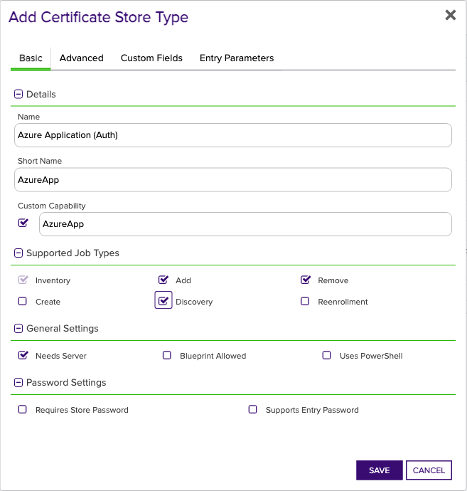
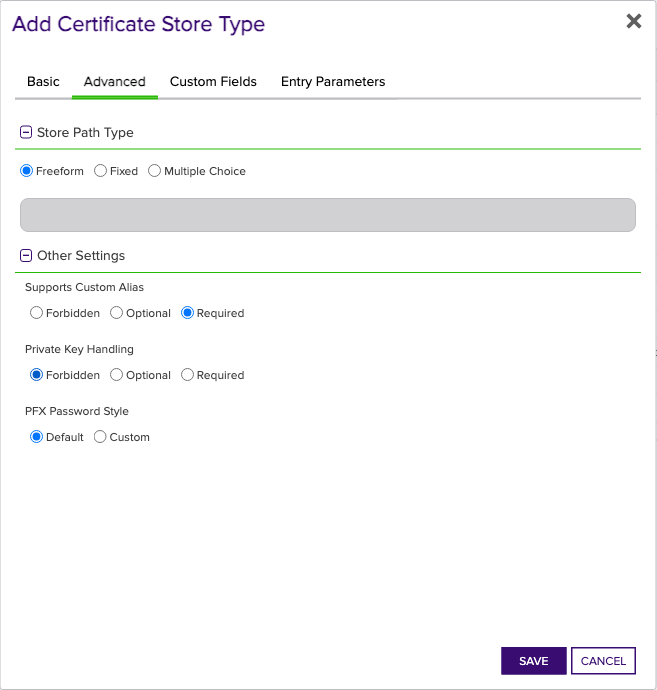
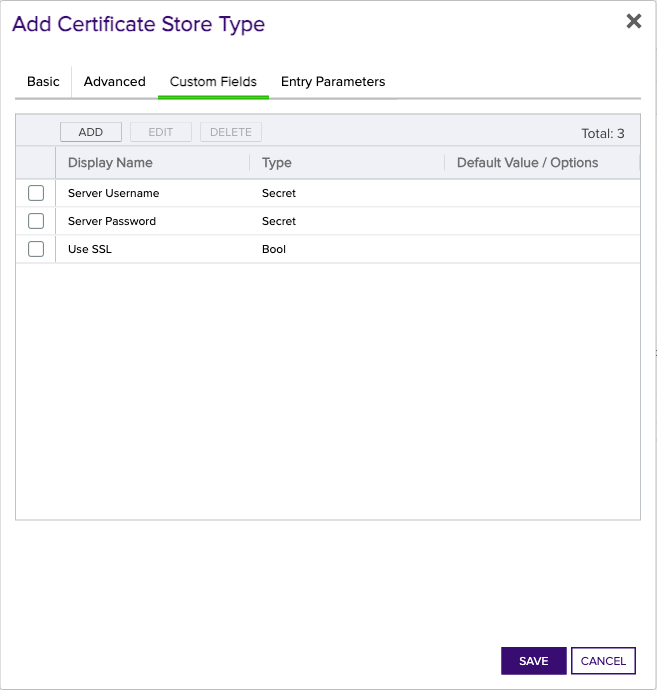

## Azure App Registration/Application

Azure [App Registration/Application certificates](https://learn.microsoft.com/en-us/entra/identity-platform/certificate-credentials) are typically used for client authentication by applications and are typically public key only in Azure. The general model by which these credentials are consumed is that the certificate and private key are accessible by the Application using the App Registration, and are passed to the service that is authenticating the Application. The Azure App Registration and Enterprise Application Orchestrator extension implements the Inventory, Management Add, Management Remove, and Discovery job types for managing these certificates.

## Requirements

### Azure Service Principal (Graph API Authentication)

The Azure App Registration and Enterprise Application Orchestrator extension uses an [Azure Service Principal](https://learn.microsoft.com/en-us/entra/identity-platform/app-objects-and-service-principals?tabs=browser) for authentication. Follow [Microsoft's documentation](https://learn.microsoft.com/en-us/entra/identity-platform/howto-create-service-principal-portal) to create a service principal. Currently, Client Secret authentication is supported. The Service Principal must have the following API Permission:
- **_Microsoft Graph Application Permissions_**:
  - `Application.ReadWrite.All` (_not_ Delegated; Admin Consent) - Allows the app to create, read, update and delete applications and service principals without a signed-in user.

> For more information on Admin Consent for App-only access (also called "Application Permissions"), see the [primer on application-only access](https://learn.microsoft.com/en-us/azure/active-directory/develop/app-only-access-primer).

Alternatively, the Service Principal can be granted the `Application.ReadWrite.OwnedBy` permission if the Service Principal is only intended to manage its own App Registration/Application.

#### Client Certificate or Client Secret

Beginning in version 3.0.0, the Azure App Registration and Enterprise Application Orchestrator extension supports both [client certificate authentication](https://learn.microsoft.com/en-us/graph/auth-register-app-v2#option-1-add-a-certificate) and [client secret](https://learn.microsoft.com/en-us/graph/auth-register-app-v2#option-2-add-a-client-secret) authentication.

* **Client Secret** - Follow [Microsoft's documentation](https://learn.microsoft.com/en-us/graph/auth-register-app-v2#option-2-add-a-client-secret) to create a Client Secret. This secret will be used as the **Server Password** field in the [Certificate Store Configuration](#certificate-store-configuration) section.
* **Client Certificate** - Create a client certificate key pair with the Client Authentication extended key usage. The client certificate will be used in the ClientCertificate field in the [Certificate Store Configuration](#certificate-store-configuration) section. If you have access to Keyfactor Command, the instructions in this section walk you through enrolling a certificate and ensuring that it's in the correct format. Once enrolled, follow [Microsoft's documentation](https://learn.microsoft.com/en-us/graph/auth-register-app-v2#option-1-add-a-certificate) to add the _public key_ certificate (no private key) to the service principal used for authentication.

    The certificate can be in either of the following formats:
    * Base64-encoded PKCS#12 (PFX) with a matching private key.
    * Base64-encoded PEM-encoded certificate _and_ PEM-encoded PKCS8 private key. Make sure that the certificate and private key are separated with a newline. The order doesn't matter - the extension will determine which is which.

    If the private key is encrypted, the encryption password will replace the **Server Password** field in the [Certificate Store Configuration](#certificate-store-configuration) section.

> **Creating and Formatting a Client Certificate using Keyfactor Command**
>
> To get started quickly, you can follow the instructions below to create and properly format a client certificate to authenticate to the Microsoft Graph API.
>
> 1. In Keyfactor Command, hover over **Enrollment** and select **PFX Enrollment**.
> 2. Select a **Template** that supports Client Authentication as an extended key usage.
> 3. Populate the certificate subject as appropriate for the Template. It may be sufficient to only populate the Common Name, but consult your IT policy to ensure that this certificate is compliant.
> 4. At the bottom of the page, uncheck the box for **Include Chain**, and select either **PFX** or **PEM** as the certificate Format.
> 5. Make a note of the password on the next page - it won't be shown again.
> 6. Prepare the certificate and private key for Azure and the Orchestrator extension:
>     * If you downloaded the certificate in PEM format, use the commands below:
>
>        ```shell
>        # Verify that the certificate downloaded from Command contains the certificate and private key. They should be in the same file
>        cat <your_certificate.pem>
>
>        # Separate the certificate from the private key
>        openssl x509 -in <your_certificate.pem> -out pubkeycert.pem
>
>        # Base64 encode the certificate and private key
>        cat <your_certificate.pem> | base64 > clientcertkeypair.pem.base64
>        ```
>
>    * If you downloaded the certificate in PFX format, use the commands below:
>
>        ```shell
>        # Export the certificate from the PFX file
>        openssl pkcs12 -in <your_certificate.pfx> -clcerts -nokeys -out pubkeycert.pem
>
>        # Base64 encode the PFX file
>        cat <your_certificate.pfx> | base64 > clientcert.pfx.base64
>        ```
> 7. Follow [Microsoft's documentation](https://learn.microsoft.com/en-us/graph/auth-register-app-v2#option-1-add-a-certificate) to add the public key certificate to the service principal used for authentication.
>
> You will use `clientcert.[pem|pfx].base64` as the **ClientCertificate** field in the [Certificate Store Configuration](#certificate-store-configuration) section. 


### Azure App Registration (Application)

#### Application Certificates

Application certificates are used for client authentication and are typically public key only. No additional configuration in Azure is necessary to manage Application certificates since all App Registrations can contain any number of [Certificates and Secrets](https://learn.microsoft.com/en-us/entra/identity-platform/quickstart-register-app#add-credentials). Unless the Discovery job is used, you should collect the Application IDs for each App Registration that contains certificates to be managed.

## Extension Mechanics

The Azure App Registration and Enterprise Application Orchestrator extension uses the [Microsoft Dotnet Graph SDK](https://learn.microsoft.com/en-us/graph/sdks/sdks-overview) to interact with the Microsoft Graph API. The extension uses the following Graph API endpoints to manage Application certificates:

* [Get Application](https://learn.microsoft.com/en-us/graph/api/application-get?view=graph-rest-1.0&tabs=http) - Used to obtain the Object ID of the App Registration, and to download the certificates owned by the App Registration.
* [Update Application](https://learn.microsoft.com/en-us/graph/api/application-update?view=graph-rest-1.0&tabs=http) - Used to modify the App Registration to add or remove certificates.
    * Specifically, the extension manipulates the [`keyCredentials` resource](https://learn.microsoft.com/en-us/graph/api/resources/keycredential?view=graph-rest-1.0) of the Application object.

### Discovery Job

The Discovery operation discovers all Azure App Registrations that the Service Principal has access to. The discovered App Registrations (specifically, their Application IDs) are reported back to Command and can be easily added as certificate stores from the Locations tab.

The Discovery operation uses the "Directories to search" field, and accepts input in one of the following formats:
- `*` - If the asterisk symbol `*` is used, the extension will search for all Azure App Registrations that the Service Principal has access to, but only in the tenant that the discovery job was configured for as specified by the "Client Machine" field in the certificate store configuration.
- `<tenant-id>,<tenant-id>,...` - If a comma-separated list of tenant IDs is used, the extension will search for all Azure App Registrations available in each tenant specified in the list. The tenant IDs should be the GUIDs associated with each tenant, and it's the user's responsibility to ensure that the service principal has access to the specified tenants.

## Certificate Store Type Configuration

The recommended method for creating the `AzureApp` Certificate Store Type is to use [kfutil](https://github.com/Keyfactor/kfutil). After installing, use the following command to create the `AzureApp` Certificate Store Type:

```shell
kfutil store-types create AzureApp
```

Alternatively, you can create the `AzureApp` Certificate Store Type manually by following the following steps:

<details><summary>AzureApp</summary>

Create a store type called `AzureApp` with the attributes in the tables below:

### Basic Tab
| Attribute | Value | Description |
| --------- | ----- | ----- |
| Name | Azure Application (Auth) | Display name for the store type (may be customized) |
| Short Name | AzureApp | Short display name for the store type |
| Capability | AzureApp | Store type name orchestrator will register with. Check the box to allow entry of value |
| Supported Job Types (check the box for each) | Add, Discovery, Remove | Job types the extension supports |
| Needs Server | &check; | Determines if a target server name is required when creating store |
| Blueprint Allowed |  | Determines if store type may be included in an Orchestrator blueprint |
| Uses PowerShell |  | Determines if underlying implementation is PowerShell |
| Requires Store Password |  | Determines if a store password is required when configuring an individual store. |
| Supports Entry Password |  | Determines if an individual entry within a store can have a password. |


The Basic tab should look like this:



### Advanced Tab
| Attribute | Value | Description |
| --------- | ----- | ----- |
| Supports Custom Alias | Required | Determines if an individual entry within a store can have a custom Alias. |
| Private Key Handling | Forbidden | This determines if Keyfactor can send the private key associated with a certificate to the store. Required because IIS certificates without private keys would be invalid. |
| PFX Password Style | Default | 'Default' - PFX password is randomly generated, 'Custom' - PFX password may be specified when the enrollment job is created (Requires the Allow Custom Password application setting to be enabled.) |


The Advanced tab should look like this:



### Custom Fields Tab
Custom fields operate at the certificate store level and are used to control how the orchestrator connects to the remote target server containing the certificate store to be managed. The following custom fields should be added to the store type:

| Name | Display Name | Type | Default Value/Options | Required | Description |
| ---- | ------------ | ---- | --------------------- | -------- | ----------- |
| ServerUsername | Server Username | Secret |  |  | The Application ID of the Service Principal used to authenticate with Microsoft Graph for managing Application/Service Principal certificates. |
| ServerPassword | Server Password | Secret |  |  | A Client Secret that the extension will use to authenticate with Microsoft Graph for managing Application/Service Principal certificates. |
| ServerUseSsl | Use SSL | Bool | true | &check; | Specifies whether SSL should be used for communication with the server. Set to 'true' to enable SSL, and 'false' to disable it. |
| ClientCertificate | Client Certificate | Secret |  |  | The client certificate used to authenticate with Microsoft Graph for managing Application/Service Principal certificates. See the [requirements](#client-certificate-or-client-secret) for more information. |


The Custom Fields tab should look like this:



</details>

## Certificate Store Configuration

After creating the `AzureApp` Certificate Store Type and installing the Azure App Registration and Enterprise Application Orchestrator extension, you can create new [Certificate Stores](https://software.keyfactor.com/Core-OnPrem/Current/Content/ReferenceGuide/Certificate%20Stores.htm?Highlight=certificate%20store) to manage certificates in the remote platform.

The following table describes the required and optional fields for the `AzureApp` certificate store type.

| Attribute | Description |
| --------- | ----------- |
| Category | Select Azure Application (Auth)  or the customized certificate store name from the previous step. |
| Container | Optional container to associate certificate store with. |
| Client Machine | The Azure Tenant (directory) ID that owns the Service Principal. |
| Store Path | The Application ID of the target Application/Service Principal that will be managed by the Azure App Registration and Enterprise Application Orchestrator extension. |
| Orchestrator | Select an approved orchestrator capable of managing AzureApp certificates. Specifically, one with the AzureApp capability. |
| Server Username | The Application ID of the Service Principal used to authenticate with Microsoft Graph for managing Application/Service Principal certificates. |
| Server Password | A Client Secret that the extension will use to authenticate with Microsoft Graph for managing Application/Service Principal certificates. |
| Use SSL | Specifies whether SSL should be used for communication with the server. Set to 'true' to enable SSL, and 'false' to disable it. |
| Client Certificate | The client certificate used to authenticate with Microsoft Graph for managing Application/Service Principal certificates. See the [requirements](#client-certificate-or-client-secret) for more information. |

* **Using kfutil**

    ```shell
    # Generate a CSV template for the AzureApp certificate store
    kfutil stores import generate-template --store-type-name AzureApp --outpath AzureApp.csv

    # Open the CSV file and fill in the required fields for each certificate store.

    # Import the CSV file to create the certificate stores
    kfutil stores import csv --store-type-name AzureApp --file AzureApp.csv
    ```

* **Manually with the Command UI**: In Keyfactor Command, navigate to Certificate Stores from the Locations Menu. Click the Add button to create a new Certificate Store using the attributes in the table above.


