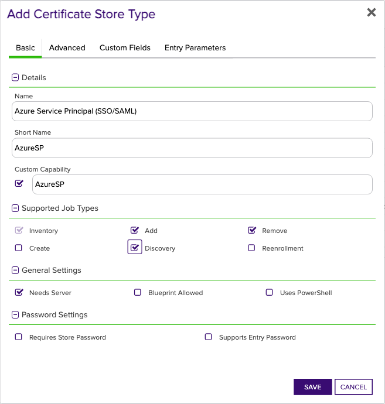
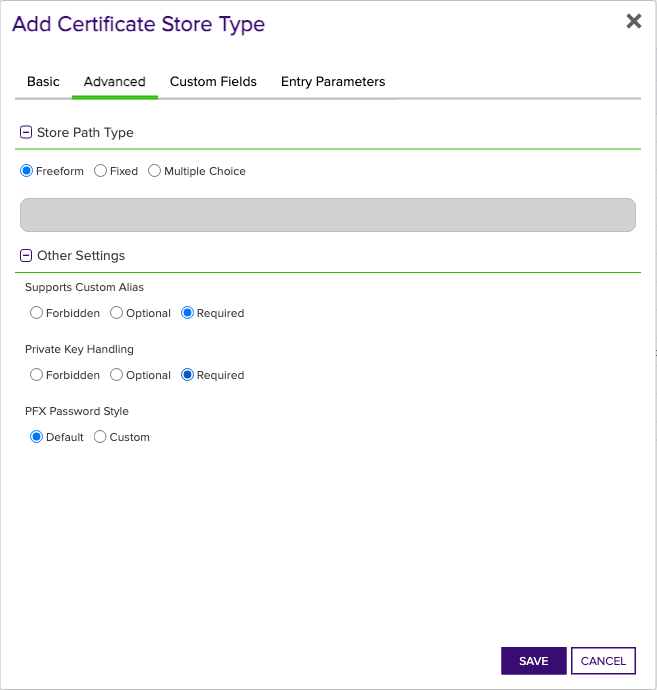
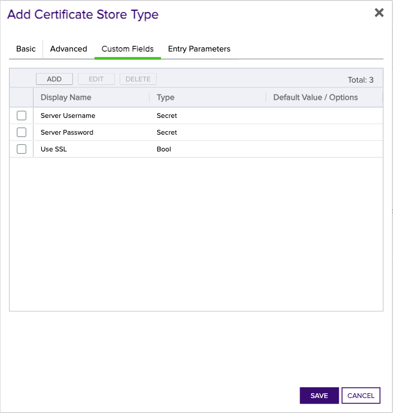

### Azure Enterprise Application/Service Principal

The Azure Enterprise Application/Service Principal certificate operations are implemented by the `AzureSP` store type, and supports the management of a single certificate for use in SSO/SAML assertion signing. The Management Add operation is only supported with the certificate replacement option, since adding a new certificate will replace the existing certificate. The Add operation will also set newly added certificates as the active certificate for SSO/SAML usage. The Management Remove operation removes the certificate from the Enterprise Application/Service Principal, which is the same as removing the SSO/SAML signing certificate. The Discovery operation discovers all Enterprise Applications/Service Principals in the tenant.


## Requirements

### Azure Service Principal (Graph API Authentication)

The Azure App Registration and Enterprise Application Orchestrator extension uses an [Azure Service Principal](https://learn.microsoft.com/en-us/entra/identity-platform/app-objects-and-service-principals?tabs=browser) for authentication. Follow [Microsoft's documentation](https://learn.microsoft.com/en-us/entra/identity-platform/howto-create-service-principal-portal) to create a service principal. Currently, Client Secret authentication is supported. The Service Principal must have the following API Permission:
- **_Microsoft Graph Application Permissions_**:
  - `Application.ReadWrite.All` (_not_ Delegated; Admin Consent) - Allows the app to create, read, update and delete applications and service principals without a signed-in user.

> For more information on Admin Consent for App-only access (also called "Application Permissions"), see the [primer on application-only access](https://learn.microsoft.com/en-us/azure/active-directory/develop/app-only-access-primer).

Alternatively, the Service Principal can be granted the `Application.ReadWrite.OwnedBy` permission if the Service Principal is only intended to manage its own App Registration/Application.

### Enterprise Application (Service Principal)

#### Service Principal Certificates

Service Principal certificates are typically used for SAML Token signing. Service Principals are created from Enterprise Applications, and will mostly be configured with a variation of Microsoft's [SAML-based single sign-on](https://learn.microsoft.com/en-us/entra/identity/enterprise-apps/add-application-portal) documentation. For more information on the mechanics of the Service Principal certificate management capabilities of this extension, please see the [mechanics](#extension-mechanics) section.

## Extension Mechanics

The Azure App Registration and Enterprise Application Orchestrator extension uses the [Microsoft Dotnet Graph SDK](https://learn.microsoft.com/en-us/graph/sdks/sdks-overview) to interact with the Microsoft Graph API. The extension uses the following Graph API endpoints to manage Service Principal certificates:

* [Get Service Principal](https://learn.microsoft.com/en-us/graph/api/serviceprincipal-get?view=graph-rest-1.0&tabs=http) - Used to obtain the Object ID of the Enterprise Application, and to download the certificates owned by the Service Principal.
* [Update Service Principal](https://learn.microsoft.com/en-us/graph/api/serviceprincipal-update?view=graph-rest-1.0&tabs=http) - Used to modify the Enterprise Application to add or remove certificates.
    * Specifically, the extension manipulates the [`keyCredentials` resource](https://learn.microsoft.com/en-us/graph/api/resources/keycredential?view=graph-rest-1.0) of the Service Principal object.

## Certificate Store Type Configuration

The recommended method for creating the `AzureSP` Certificate Store Type is to use [kfutil](https:/../.github.com/Keyfactor/kfutil). After installing, use the following command to create the `AzureSP` Certificate Store Type:

```shell
kfutil store-types create AzureSP
```

Alternatively, you can create the `AzureSP` Certificate Store Type manually by following the following steps:

<details><summary>AzureSP</summary>

Create a store type called `AzureSP` with the attributes in the tables below:

### Basic Tab
| Attribute | Value | Description |
| --------- | ----- | ----- |
| Name | Azure Service Principal (SSO/SAML) | Display name for the store type (may be customized) |
| Short Name | AzureSP | Short display name for the store type |
| Capability | AzureSP | Store type name orchestrator will register with. Check the box to allow entry of value |
| Supported Job Types (check the box for each) | Add, Discovery, Remove | Job types the extension supports |
| Needs Server | &check; | Determines if a target server name is required when creating store |
| Blueprint Allowed |  | Determines if store type may be included in an Orchestrator blueprint |
| Uses PowerShell |  | Determines if underlying implementation is PowerShell |
| Requires Store Password |  | Determines if a store password is required when configuring an individual store. |
| Supports Entry Password |  | Determines if an individual entry within a store can have a password. |


The Basic tab should look like this:



### Advanced Tab
| Attribute | Value | Description |
| --------- | ----- | ----- |
| Supports Custom Alias | Required | Determines if an individual entry within a store can have a custom Alias. |
| Private Key Handling | Required | This determines if Keyfactor can send the private key associated with a certificate to the store. Required because IIS certificates without private keys would be invalid. |
| PFX Password Style | Default | 'Default' - PFX password is randomly generated, 'Custom' - PFX password may be specified when the enrollment job is created (Requires the Allow Custom Password application setting to be enabled.) |


The Advanced tab should look like this:



### Custom Fields Tab
Custom fields operate at the certificate store level and are used to control how the orchestrator connects to the remote target server containing the certificate store to be managed. The following custom fields should be added to the store type:

| Name | Display Name | Type | Default Value/Options | Required | Description |
| ---- | ------------ | ---- | --------------------- | -------- | ----------- |
| ServerUsername | Server Username | Secret |  |  | The Application ID of the Service Principal used to authenticate with Microsoft Graph for managing Application/Service Principal certificates. |
| ServerPassword | Server Password | Secret |  |  | A Client Secret that the extension will use to authenticate with Microsoft Graph for managing Application/Service Principal certificates. |
| ServerUseSsl | Use SSL | Bool | true | &check; | Specifies whether SSL should be used for communication with the server. Set to 'true' to enable SSL, and 'false' to disable it. |


The Custom Fields tab should look like this:



</details>


## Certificate Store Configuration

After creating the `AzureSP` Certificate Store Type and installing the Azure App Registration and Enterprise Application Orchestrator extension, you can create new [Certificate Stores](https://software.keyfactor.com/Core-OnPrem/Current/Content/ReferenceGuide/Certificate%20Stores.htm?Highlight=certificate%20store) to manage certificates in the remote platform.

The following table describes the required and optional fields for the `AzureSP` certificate store type.

| Attribute | Description |
| --------- | ----------- |
| Category | Select Azure Service Principal (SSO/SAML)  or the customized certificate store name from the previous step. |
| Container | Optional container to associate certificate store with. |
| Client Machine | The Azure Tenant (directory) ID that owns the Service Principal. |
| Store Path | The Application ID of the target Application/Service Principal that will be managed by the Azure App Registration and Enterprise Application Orchestrator extension. |
| Orchestrator | Select an approved orchestrator capable of managing AzureSP certificates. Specifically, one with the AzureSP capability. |
| Server Username | The Application ID of the Service Principal used to authenticate with Microsoft Graph for managing Application/Service Principal certificates. |
| Server Password | A Client Secret that the extension will use to authenticate with Microsoft Graph for managing Application/Service Principal certificates. |
| Use SSL | Specifies whether SSL should be used for communication with the server. Set to 'true' to enable SSL, and 'false' to disable it. |

* **Using kfutil**

    ```shell
    # Generate a CSV template for the AzureSP certificate store
    kfutil stores import generate-template --store-type-name AzureSP --outpath AzureSP.csv

    # Open the CSV file and fill in the required fields for each certificate store.

    # Import the CSV file to create the certificate stores
    kfutil stores import csv --store-type-name AzureSP --file AzureSP.csv
    ```

* **Manually with the Command UI**: In Keyfactor Command, navigate to Certificate Stores from the Locations Menu. Click the Add button to create a new Certificate Store using the attributes in the table above.

